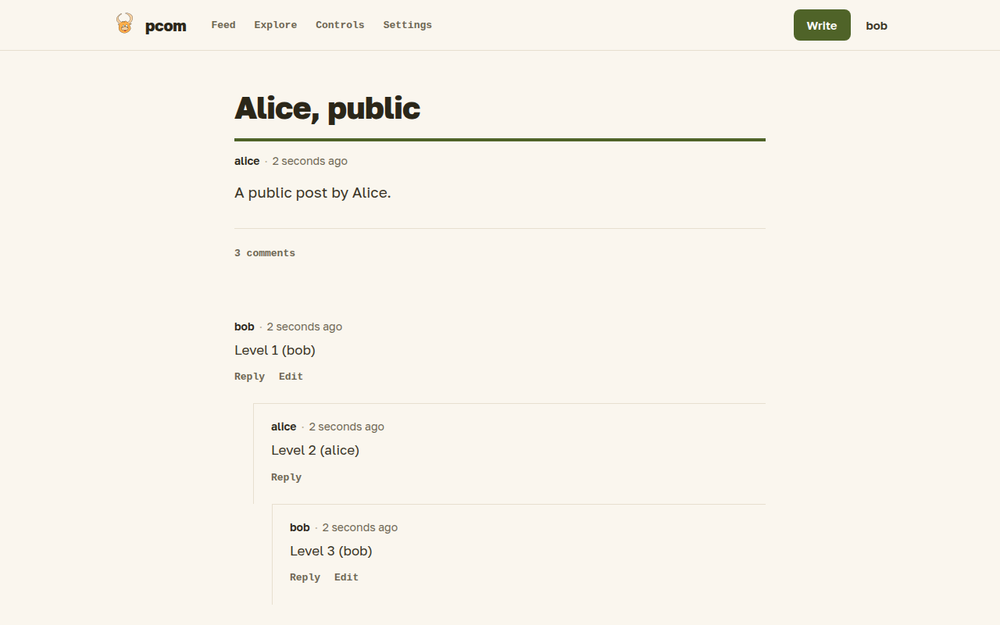

# Comments

You can comment on posts of your direct connections and on your own posts, and reply to other comments. You get an email when somebody joins a discussion you are part of.

## Commenting

On the post itself, click the comment count ("No Comments yet" or "N comments") to open the comment form. The "Leave a comment" button on each comment replies to it, and replies are nested under the comment they answer. Comments are written in markdown, are between 3 and 6,000 characters long and can include images with the camera button.

Comments are open to you and your direct connections only. If you can see a post as a second-degree connection or as a stranger, you can read it but not its comments, and you can't leave one. Comments can't be edited after sending.

## Notifications

Pcom tells you by email when:

- somebody comments on your post, or on a post you commented on;
- a connection publishes a post;
- a connection answers your prompt;
- somebody prompts you to write.

Comments on posts you take part in are also listed in your [feed](feed.md). There is no setting to turn emails off or to follow a single thread yet.
