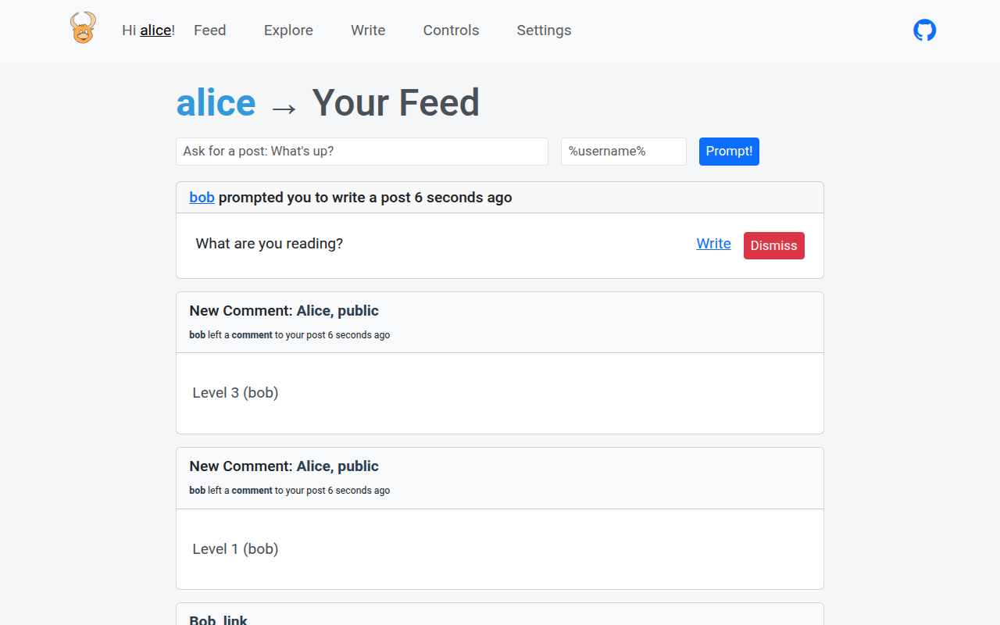
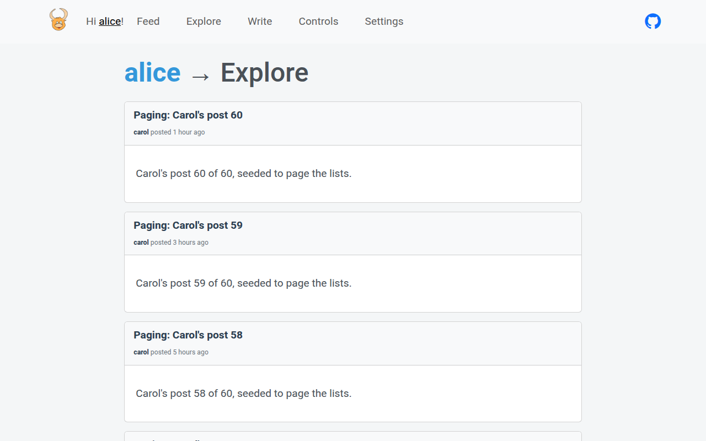

# Feed and RSS

You read what your connections write in your feed, look around at public posts in Explore and follow outside blogs by RSS. Public posts are also listed for anonymous visitors and in a public RSS feed.

## Your feed

The feed is the first thing you see after logging in. It lists, newest first:

- published posts of your direct connections;
- posts of second-degree connections, if they shared them that far, with the connections they came through;
- items from the RSS feeds you subscribe to, which you can dismiss one by one;
- new comments on posts you take part in;
- prompts other people sent you, with a button to write an answer or dismiss it.

You can also send a prompt to a connection from the top of the feed.

The feed, Explore, the public index and a journal show a page of 30 items at a time, with a "Load more" button at the bottom.

## Explore

Explore needs a login; anonymous visitors are sent to the front page. It lists public posts of authors who are open to you without a connection: public profiles, and profiles open to registered users. Nobody can comment or act from there.

## The public index

Visitors without an account land on a page of recent public posts. It only shows authors with a public profile. Its RSS icon points to `/rss/public`, a feed of the same posts that any reader can follow. A user with a public profile also has a feed of their own posts at `/rss/public/<username>`. RSS outputs, including your private feed below, hold only the latest 50 items.

## RSS subscriptions

In [Settings](settings.md) you add the URL of an RSS or Atom feed. New items then appear in your feed, where you can only dismiss them; you unsubscribe in Settings.

## Your private feed

Settings can also create a private RSS feed with the posts from your own feed, so you can read pcom in a feed reader. The address contains a secret; whoever has it can read the feed, so generate a new one if it leaks, which stops the old address working.
