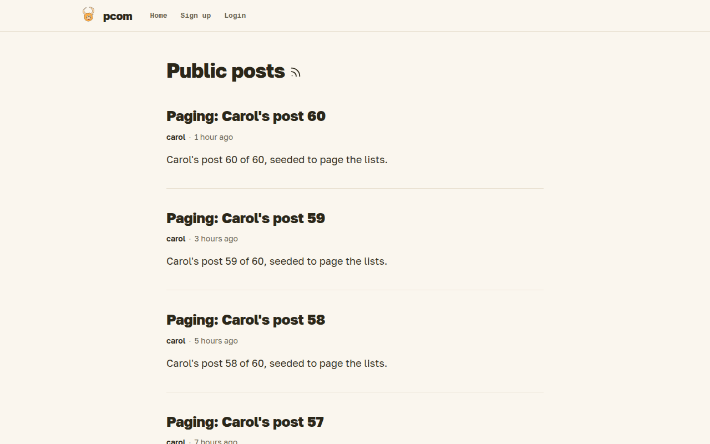

# Overview

Pcom is a small social network and blog where who can read what follows who is connected to whom. You write posts, choose how far each one travels, and find new people through the people you already know.

## The idea

Nothing is shared by default. A post reaches your direct connections, optionally the people they are connected to, or everyone, and you pick one per post. There is no search box for people: you connect to someone because you were invited, because you allowed them to connect, or because a mutual connection vouched for you. [Connections](connections.md) explains how, and spells out who sees what.

## What you can do

- Write in markdown, keep drafts and publish when ready: [Writing](writing.md).
- Read what your connections wrote, browse public posts and follow outside RSS feeds: [Feed and RSS](feed.md).
- Talk about a post with the people who can see its comments: [Comments](comments.md).
- Choose who can see your profile, change your password and take your posts with you: [Settings](settings.md).
- Post from the command line or your own scripts: [API and blg](api.md).
- Run your own copy: [Self-hosting](self-hosting.md).

## Signing up

Without an account you see the public index above and any public profile or post. To get an account you follow an invitation from a member, which also connects you to them, or you sign up on the site if it is open. An account created from an invitation gets one invitation of its own, shown in [Settings](settings.md); more come from the site admin.

The source and the developer documentation are on [GitHub](https://github.com/can3p/pcom); the [README](../../README.md) is the way in.
