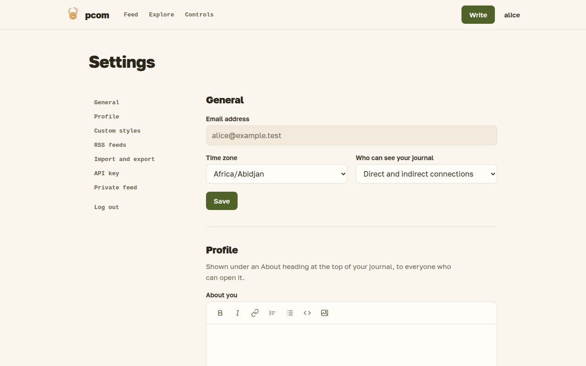

# Settings

Settings is where you manage your account: who can see your profile, invitations, feeds, API key and a backup of your posts.

## General

You can see your email address, set your time zone, which decides how times are shown to you, and choose your profile visibility: public, registered users, or direct and indirect connections. What each means is in [Connections](connections.md).

## Invitations

Pcom grows by invitation. This section appears only while you have unused or sent invitations, and shows how many are left and to whom you sent the others. Send one to an email address and the recipient gets a link to create an account, connected to you. See [Connections](connections.md).

## Feeds and private feed

Add the URL of an RSS feed to follow it in your [feed](feed.md), and remove it again. The page also creates a private RSS feed of your pcom feed and lets you replace its address.

## Public profile

Write a short text about yourself, in markdown. It appears under an "About" heading at the top of your journal, for everyone who can open your journal (see [Connections](connections.md)). It can be up to 6,000 characters; leave it empty to remove it.

## Styles

You can add your own CSS, which is applied to your journal, your single-post pages, and your own feed and Explore pages.

The `us-*` classes are the stable contract for your CSS; every other class may change when pcom's design changes. Each hook marks one element:

| Class | Marks |
|---|---|
| `us-user-home` | the whole page of a journal, a feed or Explore |
| `us-user-header` | the page heading |
| `us-profile-about` | the "About" text of a journal |
| `us-feed-post` | one post in a list |
| `us-feed-post-stats` | the row of actions under a post in a list |
| `us-feed-comment` | one comment in a feed |
| `us-feed-rss-item` | one item of an RSS feed in your feed |
| `us-post-date` | the date of a post or item |
| `us-load-more` | the "load more" control at the end of a list |
| `us-single-post` | the whole page of a single post |
| `us-post-header` | the title of a single post |
| `us-post-body` | the text of a single post |
| `us-public-link` | the "Public link on" line of a shared post |
| `us-comment-stats` | the row of actions under a post, above its comments |
| `us-comments-section` | the comments of a single post |
| `us-single-comment` | one comment of a single post |
| `us-comment-form` | the form for writing a comment |

## Import and export

Export downloads all your posts with their images as a zip file; import reads such a file back, into the same or another account. Importing into the same account updates the posts you already own and skips images already uploaded under the same name; importing into another account creates new copies.

## API key

Generate an API key to use pcom from scripts or the [blg](api.md) command-line client. Once created, the key stays the same; keep it secret.
