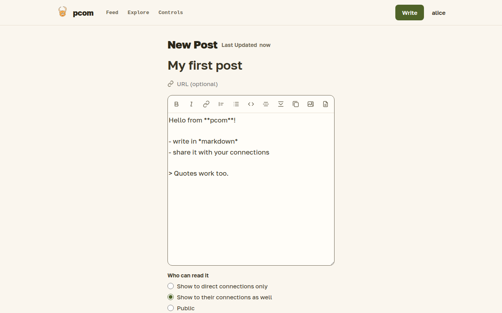
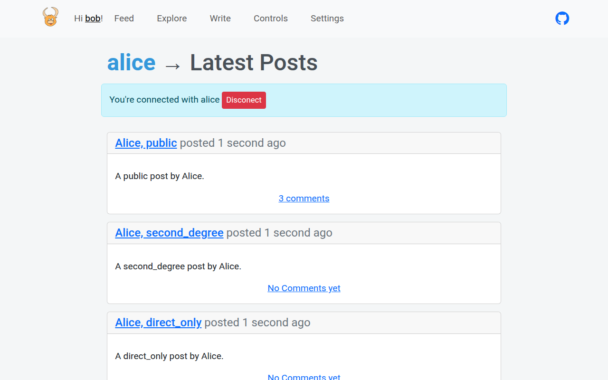

# Writing

You write posts in markdown, save them as drafts, preview them and publish when they are ready. Each post has its own visibility, and you can hand a single post to anyone with a share link.

## The editor

Open Write in the top bar. A post has an optional subject, an optional URL it is about, and a body in markdown. The toolbar at the top of the editor box inserts bold and italic text, quotes, lists, code blocks and links. Three buttons are specific to pcom: a cut that hides the rest of the post from the feed, a spoiler block that hides text until it is opened, and a gallery that groups images.

The editor saves about two seconds after you stop typing and shows when it last did. On a published post these edits go live without pressing Save. A post you have not published stays a draft; your drafts are listed on the Controls page, where you can delete them. If a connection prompted you, the editor shows their question and your post is linked to it.

## Preview

The status next to the post's title ("Last Updated …") shows when it was last saved; an unpublished post also shows a Draft badge there. The page icon in the toolbar opens the post as readers will see it, in a new tab. It appears once the post has been saved for the first time. Save as Draft saves at once and says "Draft saved" next to the buttons. Pressing Enter in the subject or URL field saves too: on a published post it saves and opens the post; it never deletes or unpublishes.

## Visibility

Below the body you choose who can read the post: "Show to direct connections only", "Show to their connections as well" (the default for a new post) or "Public". You can change it later. [Connections](connections.md) spells out what each choice means.

## Publishing

Publishing makes the post visible according to its visibility and emails your direct connections about it. You can turn a published post back into a draft or delete it; publishing it again emails your direct connections again. Only you can edit your posts.

## Images

The upload images button uploads one or more images and puts them into the post. Images can also be sent through the [API](api.md).

## Share links

On a published post of yours you can create a share link. Anybody who has the link can read that one post, with or without an account. Delete the link and the address stops working.

## Download a post

Any post you can read is also available as markdown at `/posts/<id>/md` and as a zip with its images at `/posts/<id>/zip`. The pages have no links to these addresses; you type them.

## Take your posts with you

Settings has an export of all your posts, with their images, as a zip, and an import that reads such an archive back. Importing into the same account updates the posts you already own and skips images already uploaded under the same name; importing into another account creates new copies. The details are in [Settings](settings.md).

Your journal, at `/users/<username>`, lists your published posts. Direct connections see all of them, second-degree connections the second-degree and public ones, and anonymous visitors the public ones. A logged-in user with no connection to you is told they may not see posts in the journal; see [Connections](connections.md).
